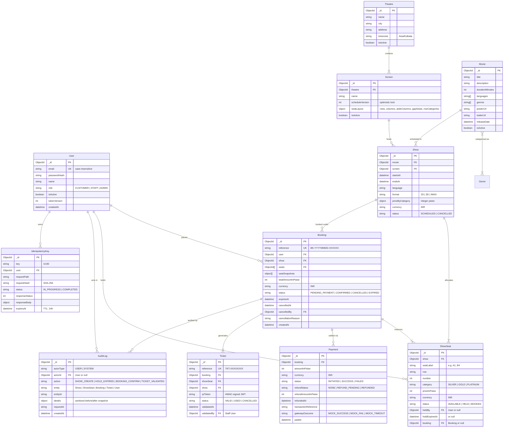

# Entity Relationship (ER) Diagram

```mermaid
erDiagram
    User ||--o{ Booking : "places"
    User ||--o{ ShowSeat : "holds"
    User ||--o{ AuditLog : "acts in"
    User ||--o{ IdempotencyKey : "owns"

    Theatre ||--|{ Screen : "contains"
    Screen ||--o{ Show : "hosts"

    Movie }|--|{ Genre : "categorized as"
    Movie ||--o{ Show : "scheduled in"

    Show ||--|{ ShowSeat : "allocates"
    Show ||--o{ Booking : "booked under"

    Booking ||--|{ ShowSeat : "reserves"
    Booking ||--o{ Payment : "settled via"
    Booking ||--|{ Ticket : "generates"
    Booking ||--o{ AuditLog : "audited by"

    User {
        ObjectId _id PK
        string email UK "case-insensitive"
        string passwordHash
        string name
        string role "CUSTOMER | STAFF | ADMIN"
        boolean isActive
        int tokenVersion
        datetime createdAt
    }

    Theatre {
        ObjectId _id PK
        string name
        string city
        string address
        string timezone "Asia/Kolkata"
        boolean isActive
    }

    Screen {
        ObjectId _id PK
        ObjectId theatre FK
        string name
        int scheduleVersion "optimistic lock"
        object seatLayout "rows, columns, aisleColumns, gapSeats, rowCategories"
        boolean isActive
    }

    Movie {
        ObjectId _id PK
        string title
        string description
        int durationMinutes
        string[] languages
        string[] genres
        string posterUrl
        string trailerUrl
        datetime releaseDate
        boolean isActive
    }

    Show {
        ObjectId _id PK
        ObjectId movie FK
        ObjectId screen FK
        datetime startsAt
        datetime endsAt
        string language
        string format "2D | 3D | IMAX"
        object priceByCategory "integer paise"
        string currency "INR"
        string status "SCHEDULED | CANCELLED"
    }

    ShowSeat {
        ObjectId _id PK
        ObjectId show FK
        string seatLabel "e.g. A1, B4"
        string row
        int number
        string category "SILVER | GOLD | PLATINUM"
        int priceInPaise
        string currency "INR"
        string status "AVAILABLE | HELD | BOOKED"
        ObjectId heldBy FK "User or null"
        datetime holdExpiresAt "or null"
        ObjectId booking FK "Booking or null"
    }

    Booking {
        ObjectId _id PK
        string reference UK "BK-YYYYMMDD-XXXXXX"
        ObjectId user FK
        ObjectId show FK
        ObjectId[] seats FK
        object[] seatSnapshots
        int totalAmountInPaise
        string currency "INR"
        string status "PENDING_PAYMENT | CONFIRMED | CANCELLED | EXPIRED"
        datetime expiresAt
        datetime cancelledAt
        ObjectId cancelledBy FK
        string cancellationReason
        datetime createdAt
    }

    Payment {
        ObjectId _id PK
        ObjectId booking FK
        int amountInPaise
        string currency "INR"
        string status "INITIATED | SUCCESS | FAILED"
        string refundStatus "NONE | REFUND_PENDING | REFUNDED"
        int refundAmountInPaise
        datetime refundedAt
        string transactionReference
        string gatewayOutcome "MOCK_SUCCESS | MOCK_FAIL | MOCK_TIMEOUT"
        datetime paidAt
    }

    Ticket {
        ObjectId _id PK
        string reference UK "TKT-XXXXXXXX"
        ObjectId booking FK
        ObjectId showSeat FK
        ObjectId show FK
        string qrToken "HMAC-signed JWT"
        string status "VALID | USED | CANCELLED"
        datetime validatedAt
        ObjectId validatedBy FK "Staff User"
    }

    AuditLog {
        ObjectId _id PK
        string actorType "USER | SYSTEM"
        ObjectId actorId FK "User or null"
        string action "SHOW_CREATE | HOLD_EXPIRED | BOOKING_CONFIRM | TICKET_VALIDATED"
        string entity "Show | ShowSeat | Booking | Ticket | User"
        string entityId
        object details "sanitized before/after snapshot"
        string requestId
        datetime createdAt
    }

    IdempotencyKey {
        ObjectId _id PK
        string key "UUID"
        ObjectId user FK
        string requestPath
        string requestHash "SHA-256"
        string status "IN_PROGRESS | COMPLETED"
        int responseStatus
        object responseBody
        datetime expiresAt "TTL: 24h"
    }
```
